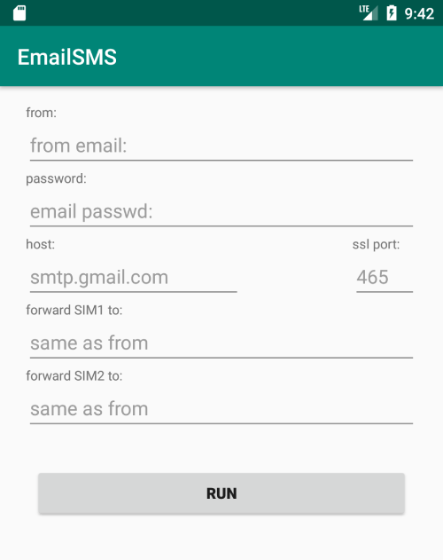

# EmailSMS

## usage
1. Install the app and run
2. Grant permissions in the Settings MANUALLY
3. Re-run
4. Config and **RUN**

## permission
- `SMS permission` is used to monitor SMS in the background

## screenshot

## TODO
1. Manage App Status
1. [Monitor the Battery Level](https://developer.android.com/training/monitoring-device-state/battery-monitoring)
1. Read Contacts
1. Email Missed Calls
1. Filter Msg
